  

  

  
  
  

  
  
  
  

## 👋 About Me

Computer Science graduate and frontend developer based in Chengdu, China. I build complete web applications with React, TypeScript, and Next.js, with a focus on type safety, resilient states, responsive UX, and maintainable component design.

- Exploring: Three.js, WebGL, and expressive 3D interfaces for the web.
- I enjoy turning product requirements into clear interaction flows, data models, and reusable components.
- Contact: `uonlra@hotmail.com` | Website: [uon1ra.top](https://www.uon1ra.top/)

## 💪 Core Strengths

<table>
  <tr>
    <td width="50%" align="center">
      <h3>🧩 Component Engineering</h3>
      

        Build business interfaces with React Hooks and composable components,
        turning lists, forms, filters, and detail panels into reusable modules.
      

    </td>
    <td width="50%" align="center">
      <h3>🛡️ Type Safety & State</h3>
      

        Use TypeScript strict, Zustand, Context API, React Hook Form, and Zod
        to establish clear data contracts and interaction flows.
      

    </td>
  </tr>
  <tr>
    <td width="50%" align="center">
      <h3>⚡ APIs & Real-Time Data</h3>
      

        Experienced with Appwrite, Convex, Clerk, and REST API integration,
        including authentication, pagination, search, uploads, and live data sync.
      

    </td>
    <td width="50%" align="center">
      <h3>📱 UX & Delivery</h3>
      

        Prioritize responsive layouts and loading, empty, and error states;
        validate delivery with Vitest, ESLint, type checks, and production builds.
      

    </td>
  </tr>
</table>

## 🔗 🛠 Tech Stack

#### 💻 Programming Languages

  
  
  
  
  
  

#### ⚛️ Frontend Development

  
  
  
  
  
  
  
  

#### 🗂️ State, Forms & Visualization

  
  
  
  

#### 🌐 Data, APIs & Authentication

  
  
  
  
  

#### ☁️ Deployment & Tooling

  
  
  
  
  

## ✨ Featured Projects

<table>
  <tr>
    <td width="100%">
      <h3>🗂️ <a href="https://github.com/Uonlra/TaskFlow">TaskFlow — Personal Task Management Workspace</a></h3>
      

        A task management application built with Next.js and TypeScript, covering authentication,
        task CRUD, multi-dimensional filtering, analytics, calendar views, and preferences. Appwrite,
        API Routes, httpOnly cookies, and middleware provide data persistence, session management, and route protection.
        A URL-based filter protocol makes filtered states restorable and shareable.
      

      

        
        
        
        
        
      

      

        <a href="https://www.uta4k.top/">Live Demo</a> ·
        <a href="https://github.com/Uonlra/TaskFlow">Source Code</a>
      

    </td>
  </tr>
</table>

 

<table>
  <tr>
    <td width="100%">
      <h3>💬 <a href="https://github.com/Uonlra/RedditLike">RedditLike — Real-Time Community Platform</a></h3>
      

        A real-time community application powered by Convex reactive queries, with communities,
        posts, comments, voting, search, trending feeds, and user profiles. It uses type-safe data models
        for users, communities, posts, and comments, plus full-text search, ownership checks, and two-stage image uploads.
      

      

        
        
        
        
        
      

      

        <a href="https://github.com/Uonlra/RedditLike">Source Code</a>
      

    </td>
  </tr>
</table>

 

<table>
  <tr>
    <td width="100%">
      <h3>🎬 <a href="https://github.com/Uonlra/U-s-cinema">U-s-cinema — Movie Discovery & Watchlist</a></h3>
      

        A React single-page application for movie discovery and personal library management, with recommendations,
        catalogs, details, favorites, watchlists, and viewing status. A generic TMDB request layer handles pagination,
        network failures, and image fallbacks, while the codebase was incrementally migrated from JavaScript to TypeScript strict.
      

      

        
        
        
        
        
      

      

        <a href="https://github.com/Uonlra/U-s-cinema">Source Code</a>
      

    </td>
  </tr>
</table>

## 📊 GitHub Activity

  

  

  

---

  <i>Open to frontend development opportunities and technical discussion.</i>

